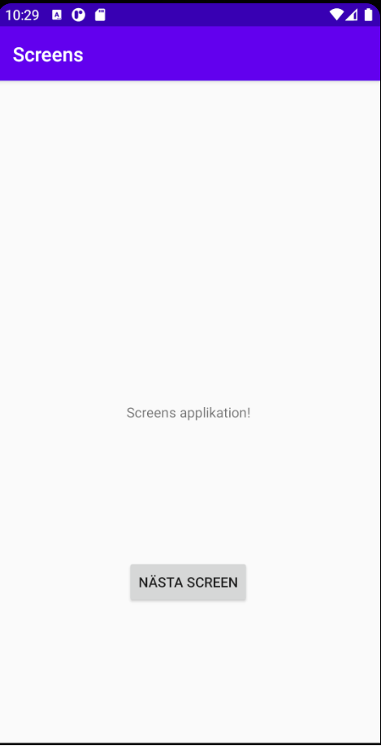
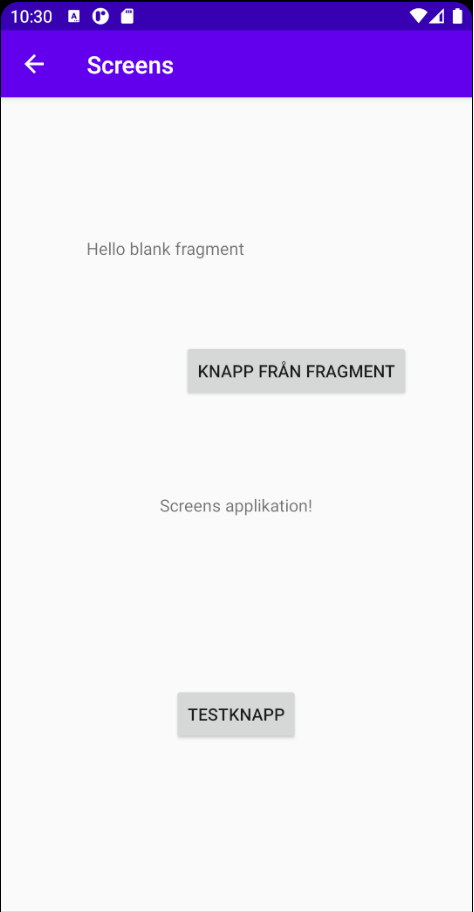

# Rapport

Arbetet började med att det skapades två nya filer. En ny aktivitetsfil och en XML fil till denna aktivitet.
Denna aktivitet visar inget förutom det som xml filen säger och har inga funktioner.
I Androidmanifest så har det lagts till information om en ny aktivitet.

´´´
<activity android:name=".screen"></activity>
´´´

Det gjordes en layout på den nya screenen och därefter lades ett fragment in. Fragmentet har sina
egna xml fil och aktivitetsfil och refereras till i xml filen som vill använda sig av fragmentet.
I detta fallet har den nya screen använt fragment och det kan vi se i koden nedan.

´´´
<fragment
        android:name="com.example.screens.BlankFragment"
        android:layout_width="match_parent"
        android:layout_height="250dp"
        android:tag="blank_fragment"
        app:layout_constraintBottom_toTopOf="@+id/textView"
        app:layout_constraintEnd_toEndOf="parent"
        app:layout_constraintStart_toStartOf="parent"
        app:layout_constraintTop_toTopOf="parent" />
´´´

Fragment är likt de andra element som finns som ex textWiew och Button oc hkan stylas på samma sätt.
Efter detta lades en Intent till. Denna intent är vad som gör att sidan ändras och det visas en ny skärm.
Koden nedan skapar först Intent och sedan kör den denna intent men detta sker bara om det har klickats
på en viss knapp. Knappen som heter sender.

´´´
        Button button = findViewById(R.id.sender);
        button.setOnClickListener(new View.OnClickListener() {
            @Override
            public void onClick(View v) {
                Intent intent = new Intent(MainActivity.this, screen.class);
                startActivity(intent);

            }
        });
´´´

Efter att detta var tillagt så fungerade appen men det gick inte att gå tillbaka. Därför lades
det till i AndroidManifest att aktiviteten screen som är den nya skärmen har en förälder aktivitet.

´´´
<activity android:name=".screen"
            android:parentActivityName=".MainActivity">

        </activity>
´´´

Nu kan man gå in till den nya skärmen och sedan gå tillbaka.
på bilderna nedan kan vi se den första skärmen och den nya skärmen med en pil
tillbaka uppe till vänster.

